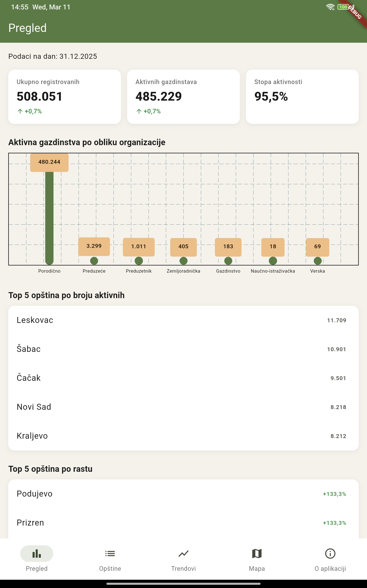
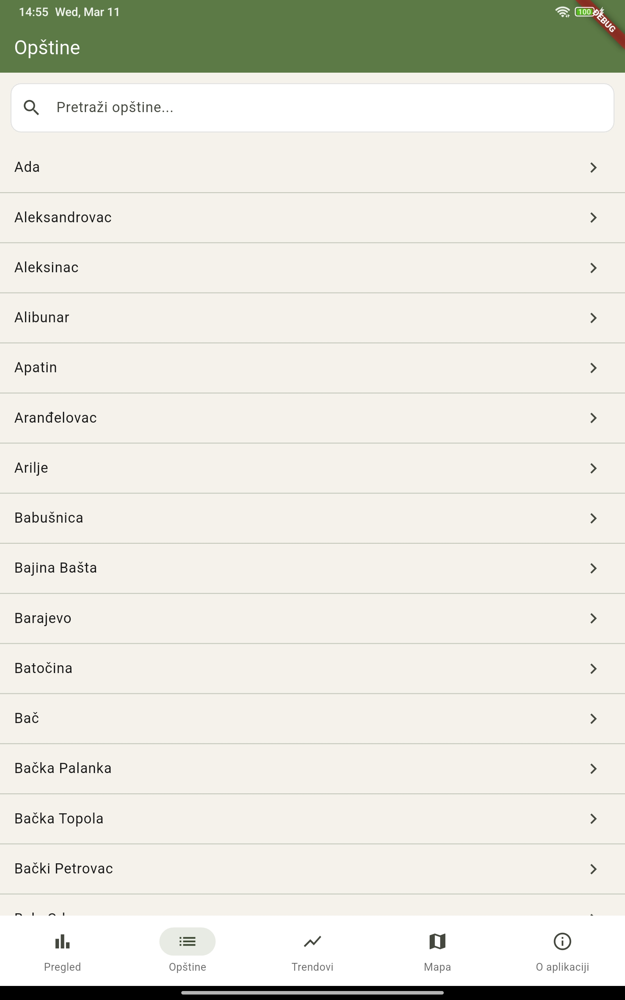
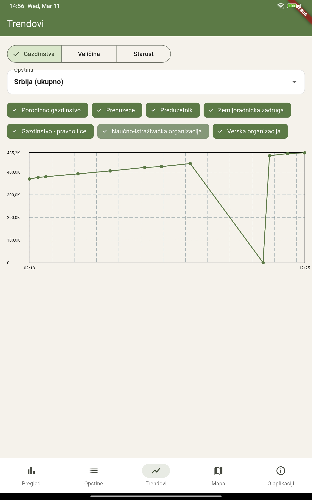
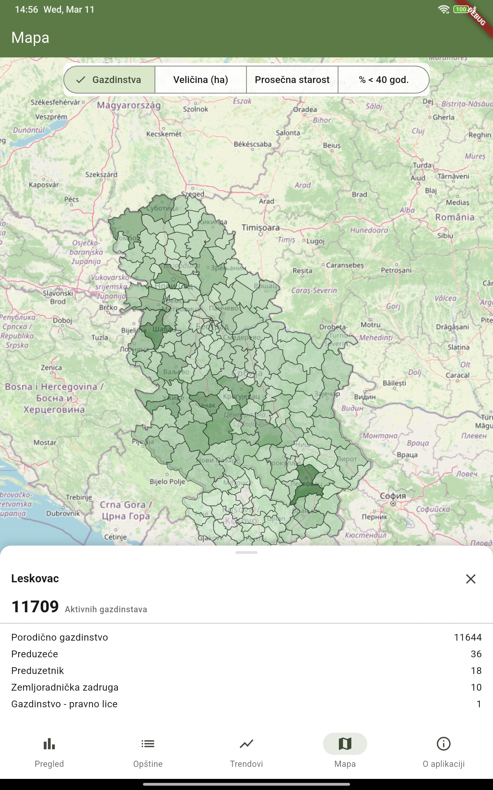

# RPG Serbia — Agricultural Farm Data Explorer

> Interactive Flutter app visualizing registered agricultural farm data across Serbian municipalities, powered by open government data from [data.gov.rs](https://data.gov.rs).


---

Explore farm statistics across 170+ municipalities with interactive charts, trends, and a choropleth map.

<table>
  <tr>
    <td align="center"><br /><b>Pregled (Overview)</b></td>
    <td align="center"><br /><b>Opštine (Municipalities)</b></td>
  </tr>
  <tr>
    <td align="center"><br /><b>Trendovi (Trends)</b></td>
    <td align="center"><br /><b>Mapa (Map)</b></td>
  </tr>
</table>

---

## Features

### Three Datasets

- **Farm Registry (RPG)** — Active and registered farms by municipality and organizational form (12 snapshots, 2018–2025)
- **Farm Size Distribution** — Farms categorized by land area (≤5 ha, 5–20 ha, 20–100 ha, >100 ha) with counts and total hectares (9 snapshots)
- **Age Structure** — Farm operator counts by 10-year age brackets (11 snapshots)

### Five Screens

- **Pregled** — National dashboard with summary cards, organizational form bar chart, top/bottom municipality rankings, farm size distribution, and age structure overview
- **Opštine** — Searchable municipality list with detail view showing trend lines, org form breakdown, size and age distributions
- **Trendovi** — Multi-dataset trend explorer with dataset selector, municipality filter, and category chips
- **Mapa** — Choropleth map with 4 selectable metrics (farm count, average size, average age, % young operators), zoom controls, and tap-to-inspect overlay
- **O aplikaciji** — Data source attribution and screen-by-screen guide

### Technical Highlights

- Resilient parallel CSV loading — individual source failures don't break the app
- Header-based CSV parsing handles government data quirks (encoding, diacritics, format inconsistencies)
- Responsive layout adapting to mobile and tablet
- 205 widget and unit tests

---

## Tech Stack

| Category | Technology |
|---|---|
| Framework | Flutter / Dart 3.11+ |
| State Management | Riverpod (code-generated) |
| Navigation | GoRouter |
| Charts | fl_chart |
| Maps | flutter_map + OpenStreetMap tiles |
| Data | CSV from data.gov.rs, GeoJSON (GADM L2) |
| Design | Material Design 3 |

---

## Data Sources

All data is fetched at runtime from [data.gov.rs](https://data.gov.rs) — the app bundles no CSV data, only GeoJSON municipality boundaries.

**Source:** [Uprava za agrarna plaćanja](https://data.gov.rs) (Administration for Agrarian Payments), Republic of Serbia

| Dataset | Contents | Snapshots |
|---|---|---|
| Farm Registry (RPG) | Active/registered farms by municipality × org form | 12 (2018–2025) |
| Farm Size Distribution | Farm counts and area by size bracket | 9 (2018–2025) |
| Age Structure | Operator counts by 10-year age bracket | 11 (2018–2025) |

> **Disclaimer:** This is an independent project. It is not affiliated with or endorsed by any Serbian government body.

---

## Getting Started

### Prerequisites

- Flutter SDK (Dart SDK ≥ 3.11.0)
- Android: SDK with default Flutter minSdkVersion (currently 21)
- iOS: Xcode with deployment target 13.0+

### Setup

```bash
git clone https://github.com/rus89/rpg-claude.git
cd rpg-claude
flutter pub get
dart run build_runner build
flutter run
```

No environment variables, API keys, or `.env` files needed — the app fetches public data directly.

### Testing

```bash
flutter test          # 205 tests
flutter analyze       # 0 issues
```

---

## Architecture

The app follows a reactive data flow: on cold start, a loading screen is shown while three CSV datasets are fetched in parallel from data.gov.rs. Riverpod providers cache the parsed data for the app's lifetime. GoRouter redirects to the dashboard once the primary dataset is ready — secondary datasets (farm size, age) load independently and don't block navigation.

Municipality names from government CSVs vary in spelling, encoding, and diacritics. A dedicated name resolver normalizes these and maps them to canonical GeoJSON boundary names.

```
lib/
├── data/           # CSV parsers, loaders, sources, name resolution
│   └── models/     # Domain models (records, snapshots, enums)
├── providers/      # Riverpod async providers (generated)
├── screens/        # 5 screens, each in own directory
├── navigation/     # GoRouter config + bottom nav shell
├── layout/         # Responsive breakpoints + scaffold
└── theme.dart      # Material 3 design tokens
```

---

## License

This project is licensed under the MIT License — see the [LICENSE](LICENSE) file for details.

---

Built with [Flutter](https://flutter.dev) and open data from [data.gov.rs](https://data.gov.rs)
